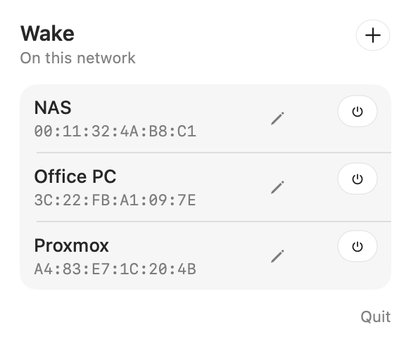

# Wake

Wake is a menu-bar app that turns on a computer over the local network. Click the power icon, press the button next to a machine, and Wake sends **one** magic packet. It does not open a window in the Dock.




The machines in the picture are examples. Your list is the one you add.

## What it does

- Sits in the menu bar with a template power icon, so it follows light and dark mode.
- Stores each machine by name and MAC address.
- Sends a single 102-byte magic packet, then ignores further clicks for one minute.
- Lets you edit a machine with the pencil, or by right-clicking the row. Right-click also removes it.
- Keeps the list on this Mac only. Nothing is uploaded, and there is no account.

## Requirements

- macOS 26 or later
- Apple silicon
- The Mac and the computer you want to wake on the **same local network**

A magic packet is a broadcast. It does not cross a router, and it does not travel over the internet. Wake the machine from a Mac on that LAN.

## Install

Command Line Tools are enough. A full Xcode install is not required.

```sh
git clone https://github.com/amirsdream/wol.git
cd wol
Support/build.sh
cp -R Wake.app /Applications/
open /Applications/Wake.app
```

`Support/build.sh` compiles an optimized arm64 binary, draws the app icon, and signs the bundle with a local signature. The built app and the icon export stay out of git.

The first time macOS asks about the local network, allow it. Wake cannot send the packet without that permission.

## Use it

1. Click the power icon in the menu bar.
2. Press **+** and enter a name and a MAC address. `A4:83:E7:1C:20:4B`, `a4-83-e7-1c-20-4b`, and `a483e71c204b` are all accepted. Wake stores the address as uppercase pairs.
3. Leave **Broadcast** closed unless you need a different address or port. The defaults are `255.255.255.255` and port `9`.
4. Press the power button on that row **once**.
5. Leave the machine alone for a minute. The button will not send again until the minute is over.

A checkmark replaces the power icon for a moment after a send. The line under the list names the interface and the address that actually received the packet, for example `en0` and `192.168.1.255`.

Quit from the bottom of the panel. There is no Dock icon to close.

## How the packet is sent

A magic packet is 6 bytes of `0xFF`, followed by the target MAC repeated 16 times. That is 102 bytes. Wake puts that payload in one UDP datagram.

The socket is bound to the active Ethernet or Wi-Fi port, preferring `en0`, with broadcast enabled. Binding matters: on a Mac with several ports, an unbound broadcast can leave more than once.

If the saved address is `255.255.255.255`, Wake does **not** send it there. That limited broadcast can be copied out of more than one port, so the computer receives the packet twice a few milliseconds apart. Wake sends the datagram to that port’s own subnet broadcast instead (on a typical home LAN, something like `192.168.1.255`), port 9.

A custom address is used as you typed it. Use that only when you know the packet must go to one specific IPv4 address. The usual case is the default, which becomes the subnet broadcast.

The one-minute pause is there for the same reason. The first packet asserts the power supply. A second packet while that supply is still switching on can be read as another power-button press. The supply then latches off, and the only way to clear it is to shut the machine down fully and unplug it.

## Prepare the computer you want to wake

The packet only works if the machine is soft-off and its network card still has standby power.

- In the BIOS or UEFI, turn on Wake-on-LAN, often named **Power On By PCI-E**, **Wake on LAN**, or **Resume by PCI-E Device**.
- Turn **ErP**, **EuP**, and **Deep Sleep** off. Those cut standby power to the network card, so it can no longer hear the packet.
- Shut the operating system down cleanly. After a crash, a forced power-off, or pulling the plug, many cards will not listen again until the next clean shutdown.
- The card and the Mac must be on the same subnet. Wi-Fi power saving on the target can also drop the packet; Ethernet is the reliable path.

On Linux, including Proxmox, check the interface and arm magic-packet wake:

```sh
ethtool <interface>
ethtool -s <interface> wol g
```

`Wake-on: g` means the card is set to wake on a magic packet. Some cards forget that setting on reboot, so the distribution’s network config has to set it again. A USB network adapter often cannot do this at all. The onboard Ethernet port is the one that usually can.

## Where the list is stored

```
~/Library/Application Support/local.wol.wake/devices.json
```

Removing that file clears the list. Wake recreates it the next time you add a machine.

## Project layout

| Path | Role |
| --- | --- |
| `Sources/WakeApp.swift` | Menu-bar item and popover |
| `Sources/Panel.swift` | The panel: list, editor, one-minute pause |
| `Sources/Packet.swift` | Magic packet and the single send |
| `Sources/Store.swift` | The device list on disk |
| `Sources/Icon.swift` | Menu-bar glyph and app icon |
| `Support/build.sh` | Compile, icon, and sign |
| `Support/Info.plist` | Bundle settings, including macOS 26 and no Dock icon |

## When it does not wake

**The line under the list says the packet did not leave.** The Mac has no up `en*` interface with an IPv4 broadcast address, or the local-network permission was denied. Wake will not send on the loopback interface.

**The MAC field will not save.** It needs 12 hexadecimal digits. Extra separators are fine. Anything else is not.

**The fans spin, then the machine turns off, and it will not come back until you unplug it.** It received a second packet during power-on. Unplug the power supply, wait half a minute, plug it back in, and shut the machine down cleanly from its own system before trying again. Press Wake once.

**Nothing happens, and the packet did leave.** The card is not armed. Check the BIOS options above, confirm `ethtool` shows `Wake-on: g`, and confirm the last shutdown was clean. A card that lost power completely (ErP, or the plug was pulled) stays deaf until that clean shutdown.

**It used to work and then stopped.** Some boards only listen after the operating system has shut down once with Wake-on-LAN enabled. A later firmware setting, or a shutdown from the power button instead of the system, disarms it again.

## Limits

Wake sends the UDP form of the magic packet, which is what a normal app is allowed to send. The other form is a raw Ethernet frame with EtherType `0x0842`. That frame is what some cards’ hardware filters expect, and sending it requires root. Wake does not send it, and it does not send a second copy on another port.

There is no SecureOn password in the packet. A card configured with a password will ignore this wake.

Wake speaks IPv4 only. It does not wake a machine on another subnet, over a VPN, or across the internet.
